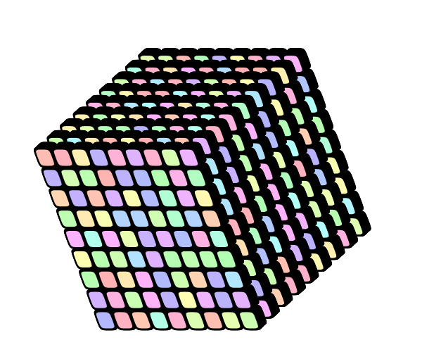

# konte-art


[meshm2.c3dg](img/README/meshm2.c3dg)

Konte is a small language for generating images, "drawing by coding".  All images on this page were written in it, strict mode.

*Konte is an art project. Its code is old and a bit edgy. I'll be cleaning it up, but you were warned.*

Some technical notes about what the app does:

 - it projects arbitrary z-ordered and linearly transformed 3D bezier paths on a Java2D canvas
 - there is no edge clipping, so 3D is "semi" in this way; you should avoid excessively large shapes that could create strange overlap effects
 - there is a layering property in the language, so you can draw on multiple layers like in Photoshop
 - there is an ad hoc support for meshes
 - RGBA, HSLA and user defined color spaces are supported
 - a simple "independent shapes" lighting model is supported, with lights controlled by arbitrary expressions
 - 3D, ortographic and cabinet (oblique) perspectives are supported


[mcs6_9.c3dg](img/README/mcs6_9.c3dg)

##Building and running

Build the project from command line.

```
$ mvn clean install
```
Run the UI from command line.

```
$ java -Xmx2048m -cp target/konte.jar org.konte.ui.Ui
```

There are online examples in the *Tutorials* menu, so you should be good from that on.  A short introduction to the language is given below.


[do-w-meshes.c3dg](img/README/do-w-meshes.c3dg)

##Some notes on generating form

Konte is a mutation of the [contextfreeart.org](http://contextfreeart.org/) language.  In konte, you draw in three dimensions.

There are some predefined shapes like ```SQUARE``` and ```RSQU``` (a rounded square) that you can draw. Here is the list, and you can create your own shapes too.

###Shapes


[shapes.c3dg](img/README/shapes.c3dg)

```
SQUARE {...}
RSQU {...}
CIRCLE {...}
TRIANGLE {...}
RTRIANGLE {...}
BOX {...}
PIPE {...}
CONE {...}
SPHERE {...}
```

I find flat shapes like squares and circles most useful in the pack.

###User paths

Also user paths like the following are supported.


[hearts.c3dg](img/README/hearts.c3dg)

There is a basic svg path import functionality in konte ui, so you could draw your paths in a vector app or use some clipart paths and import them.  Keep in mind that konte draws in the {0..1,0..1} xy space by default, and it will try to scale an imported svg into that space.

You can also write a path by hand if you like the excercise.

```
path heart {
    moveto(0.000, 0.000, 0.000)
    bend(0.000, 0.300, 0.000)
    bend(0.400, 0.400, 0.000)
    curveto(0.400, 0.100, 0.000)
    bend(0.400, -0.200, 0.000)
    bend(0.000, -0.500, 0.000)
    curveto(0.000, -0.500, 0.000)
    bend(0.000, -0.500, 0.000)
    bend(-0.400, -0.200, 0.000)
    curveto(-0.398, 0.093, 0.000)
    bend(-0.400, 0.400, 0.000)
    bend(0.000, 0.300, 0.000)
    close
}
```

###Determinism and two types of randomness

Konte uses a seeded random feed to decide what it does next.  By multiply overriding a single rule like this,
```
do 1 {...}
do .1 {...}
do .05 {...}
```
you let konte decide which path it will take, relying on the "probabilities" ```1``` and ```.1``` and ```.05```.  I say "probabilities", because the weights do not have to add up to one.


[do-w-meshes-col.c3dg](img/README/do-w-meshes-col.c3dg)

There is also a non-deterministic random way, by using the ```rnd()``` function:
```
example2 {SQUARE {scale rnd()}}
```
This would take a single pass over and use a random value within [0..1] for an entire image.  I use a little trick of backreferencing a model property to enforce dynamic randomness:
```
example3 {SQUARE {scale rnd()+x*0}}
```


###Rules and loops

```
scene {
  cube{roty 40 rotx 20}
}
cube {
  3*{x 1/12}
    3*{y 1/12}
      3*{z 1/12}
        featurez{x -1/12 y -1/12 z -1/12 scale -1/12}
}
featurez {
  50*{z .01} RSQU{}
  RSQU{scale .8 red 1 sat -.7 hue 360*rnd()+x}
}
```

[cubes.c3dg](img/README/cubes.c3dg)

When the above fragment gets parsed into a model, the resulting tree structure looks something like this.
```
{ scene{ cube{ *{*{*{ featurez{ *{RSQU},RSQU } }}} } } }
```

As we read from top downwards, three rules are defined above: ```scene```, ```cube```, and ```featurez```.  'Scene' is the first rule and it will be the starting point: ```cube{roty 40 rotz 20}``` tells the generator first to rotate over current y axis by 40 degrees and over current x axis by 20 degrees and then jump to rule 'cube'.

There are three nested loops in ```cube```, creating 27 branches in total:
```
[A]  3*{x 1/12}
[B]    3*{y 1/12}
[C]      3*{z 1/12}
        . . .
```
By each iteration of [A], current x position is incremented by 1/12, by each iteration of [B], y by 1/12 likewise, and so for z of [C].

When the generator first handles ```featurez``` rule, it is on loop zero and its x, y and z positions are *in pristine state*.  Now the transforms in ```featurez{x -1/12 y -1/12 z -1/12 scale -1/12}``` are applied.  It happens before any loop increments, and the group gets centered around its centermost element.  First, initial transforms, and on top of that, accumulating increments in loops.

Within ```featurez```, we draw on the screen then, creating one of the 27 objects in the picture.
```
featurez {
  50*{z .01} RSQU{}
  RSQU{scale .8 red 1 sat -.7 hue 360*rnd()+x}
}
```
```50*{z .01} RSQU{}``` draws fifty black rounded squares, traveling slightly away from the screen plane.  There are 27 * 50 black shapes in the picture overall.

```RSQU{scale .8 red 1 sat -.7 hue 360*rnd()+x}``` adds a shape of a random hue.  There are 27 colored shapes in the picture.  


[cubes-big.c3dg](img/README/cubes-big.c3dg)

##Cameras

There are different types of cameras in konte.
```
camera { SIMPLE }
```

[buildings.c3dg](img/README/buildings.c3dg)
```
camera { PANNING 2.0 }  /* with initial distance -2.0 from origo */

camera { ORTOGRAPHIC }


/*
*  a cabinet perspective with a 30 degree tilt and a scale factor of 0.5:
*/
camera { CABINET 30 0.5 } 
```

[buildings-ortog.c3dg](img/README/buildings-ortog.c3dg)

```
/*
* an experimental projection:
*  [x,y] = [cos(alpha) / dist, sin(alpha) / dist]
*    where alpha = atan( x / y )  (for a point relative to the camera)
*    and dist = ( x^2 + y^2 + z^2 ) ^ (0.5 * pack)  (distance of the point from the camera)
*    where pack is a user given packing exponent, default 1.0
*/
camera { CIRCULAR 2.0 }
```

[buildings-circular.c3dg](img/README/buildings-circular.c3dg)


###Colors

Konte handles RGBA and HSLA color spaces.  HSL support is based on RGB, so it is not complete.  Adjusting the hue of a uniform grey will not do anything. There is no return from a uniform grey back to a previously used hue.


[HSL.c3dg](img/README/HSL.c3dg)

```
R //  alias red   [0..1]
G //  alias green [0..1]
B //  alias blue  [0..1]
A //  alias alpha [0..1]
H //  alias hue [0..360]
S //  sat(uration) [0..1]
L //  alias lightness [0..1]
```


[RGB.c3dg](img/README/RGB.c3dg)

###User colorspaces

A script can define its own colorspace and use it by setting ```shading``` and ```col0``` (and ```col1```).  Unlike to R,G,B and other properties, ```shading``` and ```col0``` are set as absolute values, and not incremented.


[draw-shading.c3dg](img/README/draw-shading.c3dg):
```
include eye.c3dg

DEF nn 200
DEF minx 0
DEF maxx .6

rule show {
  (nn)*{x (1/nn) 
        col0 (col0+(maxx-minx)/nn)}
    SQUARE { shading eyeshades x -.5 sx (1.2/nn) col0 (minx+col0)}
}

```
[eye.c3dg](img/README/eye.c3dg):
```
shading eyeshades { 
    point(-2)    { RGB  1  1  1 A 0  } 
    point(0)    { RGB  .1  0  0  } 
    point(0.1)  { RGB  .4 .2  0  }
    point(0.2)  { RGB 0.075 0.506 0.875  }
    point(0.4)  { RGB 1 .3 .2 A .4 }
    point(0.5)  { RGB 1  1  1   }
    point(.6)  { RGB 1  1  1  A 0 }
}
```

##Lighting

Konte allows placing lights in the space.  Rather than lights though they can be thought of as spatial expressions that modify object color.

A light consists of a spatial expression for a point light, a color expression for the light color, a scale expression giving the spherical radius, and an optional type that states if a light should be of complementary color or if it should create darkness instead of light.

```
light {point(0,0.1,-1){RGB 1 .9 .9} s 1}
```

[icescape.c3dg](img/README/icescape.c3dg)

We can mix lights and darkness to create ambient effects.  The spatial expression for a light can backreference shape properties.  In effect this means that, while drawing an object on the screen, all light expressions are evaluated on that object, and object color is modified using this dynamic outcome.

```
light {point(0,0.1,-1){RGB 1 .9 .9} s 1}
light {DARKNESS point(x+rnd(),0.1,-1){RGB 1 1 1} s .5}
```


```
light {point(0,0.1,-1){RGB 1 .9 .9} s 1}
light {COMPLEMENTARY point(.5,.1,.1){RGB 1 0 0} s .1}
```


##Drawing meshes


##More examples


<!---->


I created a hairy version of Claude Monet's [Three Trees in Grey Weather](http://www.wikiart.org/en/claude-monet#supersized-featured-212779).

Some constants are defined here using ```DEF```, and also some variables are used within rules (those ```DEF```'s within loops).  Finally, pixel values are retrieved from a bitmap on the local disk.
```
bg {RGB 0.980 0.969 0.914}
include "~/Pictures/monet-grey.png" img0
DEF iw imgwidth(img0)
DEF ih imgheight(img0)
DEF pixsize (1/imgwidth(img0))
camera {z -1.3}

SS {
    draw_img{ y -.1 rx 15 ry 3}
}
rule draw_img {
    (iw) * { DEF {u=u+1} }
        (ih) * { DEF {v=v+1} }
            i_pxl
            {
                x -.5 y (.5*ih/iw)
                s pixsize 
                x u y -v
                rz (((u*u+v*v)+sin(u*7+v*7)))
                RGB imgred(img0,u%iw,v%ih) 
                    imggreen(img0,u%iw,v) 
                    imgblue(img0,u%iw,v)
            }
}
rule i_pxl { SQUARE { s 40 .05 1 }}
```


