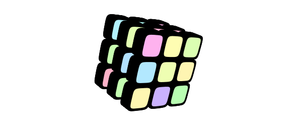

# konte-art
*This is an art project for generative graphics. Its code is old and crappy, but there are one or two nice things here. I'll be cleaning up the code, but you are warned.*

Konte is a small formal language and an execution environment for generating png images. It projects arbitrary z-ordered and linearly transformed 3D bezier paths on a Java2D canvas.

 - Bezier paths have the convenient property of translating to higher dimensions
 - a Java2D bezier routine is used here to draw 3D shapes
 - there is no edge clipping, so 3D is "semi" in this way
 - you should avoid excessively large shapes that could create strange overlap effects
 - there is a layering property in the language, so you can draw on multiple layers like in Photoshop

##Building and running

Build the project from command line.

```
$ mvn clean install
```
Run the buggy UI from command line.

```
$ java -Xmx2048m -cp target/konte.jar org.konte.ui.Ui
```

There are online examples in the *Tutorials* menu, so you should be good from that on.  A short introduction to the language is given below.

##Introduction to the language

Konte is a mutation of the [contextfreeart.org](http://contextfreeart.org/) language.  In konte, you draw in three dimensions, in contextfreeart.org in two.

There are some predefined shapes like ```SQUARE``` and ```RSQU``` (a rounded square) that you can draw. Here is the list, and you can create your own shapes too.

###Shapes


[shapes.c3dg](img/README/shapes.c3dg)

```
SQUARE {...}
RSQU {...}
CIRCLE {...}
TRIANGLE {...}
RTRIANGLE {...}
BOX {...}
PIPE {...}
CONE {...}
SPHERE {...}
```

I find flat shapes like squares and circles most useful in the pack.

###User paths


[hearts.c3dg](img/README/hearts.c3dg)

There is a crappy svg path import functionality in konte ui, so you could draw your paths in a vector app or use some clipart paths and import them.  Keep in mind that konte draws in the {0..1,0..1} xy space by default, and it will try to scale an imported bitmap into that space.

You can also write a path by hand if you like the excercise.

```
path heart {
    moveto(0.000, 0.000, 0.000)
    bend(0.000, 0.300, 0.000)
    bend(0.400, 0.400, 0.000)
    curveto(0.400, 0.100, 0.000)
    bend(0.400, -0.200, 0.000)
    bend(0.000, -0.500, 0.000)
    curveto(0.000, -0.500, 0.000)
    bend(0.000, -0.500, 0.000)
    bend(-0.400, -0.200, 0.000)
    curveto(-0.398, 0.093, 0.000)
    bend(-0.400, 0.400, 0.000)
    bend(0.000, 0.300, 0.000)
    close
}
```

###Rules and loops

[cubes.c3dg](img/README/cubes.c3dg)
```
scene {
  cube{roty 40 rotx 20}
}
cube {
  3*{x 1/12}
    3*{y 1/12}
      3*{z 1/12}
        featurez{x -1/12 y -1/12 z -1/12 scale -1/12}
}
featurez {
  50*{z .01} RSQU{}
  RSQU{scale .8 red 1 sat -.7 hue 360*rnd()+x}
}
```


As we read from top downwards, there are three rules defined above: ```scene```, ```cube```, and ```featurez```.  'Scene' is the first rule and it will be the starting point: ```cube{roty 40 rotz 20}``` tells the generator first to rotate over current y axis by 40 degrees and over current x axis by 20 degrees and then jump to rule 'cube'.

There are three nested loops in ```cube```, creating 27 branches in total:
```
[A]  3*{x 1/12}
[B]    3*{y 1/12}
[C]      3*{z 1/12}
        . . .
```
By each iteration of [A], current x position is incremented by 1/12, by each iteration of [B] y by 1/12 likewise, and so for z of [C].

When the generator first handles ```featurez``` rule, it is on loop zero and its x, y and z positions are *in pristine state*.  Now the transforms in ```featurez{x -1/12 y -1/12 z -1/12 scale -1/12}``` are applied.  It happens before any loop increments, and the group gets centered around its centermost element.  First, initial transforms, and on top of that, accumulating increments in loops.

Within ```featurez```, we draw on the screen then, creating one of the 27 objects in the picture.
```
featurez {
  50*{z .01} RSQU{}
  RSQU{scale .8 red 1 sat -.7 hue 360*rnd()+x}
}
```
Firstly, ```50*{z .01} RSQU{}``` draws fifty black rounded squares, travelling slightly away from the screen plane.  There are 27 * 50 black shapes in the picture overall.

Then, ```RSQU{scale .8 red 1 sat -.7 hue 360*rnd()+x}``` adds a shape of random hue.  There are 27 colored shapes in the picture.  

###Colors

Konte handles RGBA and HSLA color spaces.  HSL support is based on RGB, so it is not complete.  Adjusting the hue of a uniform grey will not do anything.

```
R //  alias red   [0..1]
G //  alias green [0..1]
B //  alias blue  [0..1]
A //  alias alpha [0..1]
H //  alias hue [0..360]
S //  sat(uration) [0..1]
L //  alias lightness [0..1]
```

Intricacies of the color model are explained here, referring to the previous example.
```
featurez {
  50*{z .01} RSQU{}
  RSQU{scale .8 red 1 sat -.7 hue 360*rnd()+x}
}
```

```red 1``` turns from black to bright <span style="background-color:#FF0000">red</span>.

```sat -.7``` decreases red saturation to something like <span style="background-color:#FFB3B3;">this</span> before anything got drawn.

```hue 360*rnd()+x}``` changes hue along the HSL spectrum by a random degree (where 360 would be a complete cycle).  We get anything from pink to light yellow to lime to aqua to lilac to pink.

```+x``` is a little trick that references a non constant value in the model so that pre-evaluation of ```rnd()```  wont take place.

###User colorspaces

A script can define its own colorspace and take it in use by setting ```shading``` and ```col0``` (and ```col1```).  Unlike to R,G,B and other properties, ```shading``` and ```col0``` are set as absolute values, and not incremented.


[draw-shading.c3dg](img/README/draw-shading.c3dg):
```
include eye.c3dg

DEF nn 200
DEF minx 0
DEF maxx .6

rule show {
  (nn)*{x (1/nn) 
        col0 (col0+(maxx-minx)/nn)}
    SQUARE { shading eyeshades x -.5 sx (1.2/nn) col0 (minx+col0)}
}

```
[eye.c3dg](img/README/eye.c3dg):
```
shading eyeshades { 
    point(-2)    { RGB  1  1  1 A 0  } 
    point(0)    { RGB  .1  0  0  } 
    point(0.1)  { RGB  .4 .2  0  }
    point(0.2)  { RGB 0.075 0.506 0.875  }
    point(0.4)  { RGB 1 .3 .2 A .4 }
    point(0.5)  { RGB 1  1  1   }
    point(.6)  { RGB 1  1  1  A 0 }
}
```
##More examples


I created a hairy version of Claude Monet's [painting](http://TODO).

Some constants are defined there using ```DEF```, and also some variables are used within rules (those ```DEF```'s within loops).  Finally, colors are retrieved from a bitmap on the local disk.
```
bg {RGB 0.980 0.969 0.914}
include "~/Pictures/monet-grey.png" img0
DEF iw imgwidth(img0)
DEF ih imgheight(img0)
DEF pixsize (1/imgwidth(img0))
camera {z -1.3}

SS {
    draw_img{ y -.1 rx 15 ry 3}
}
rule draw_img {
    (iw) * { DEF {u=u+1} }
        (ih) * { DEF {v=v+1} }
            i_pxl
            {
                x -.5 y (.5*ih/iw)
                s pixsize 
                x u y -v
                rz (((u*u+v*v)+sin(u*7+v*7)))
                RGB imgred(img0,u%iw,v%ih) 
                    imggreen(img0,u%iw,v) 
                    imgblue(img0,u%iw,v)
            }
}
rule i_pxl { SQUARE { s 40 .05 1 }}
```

